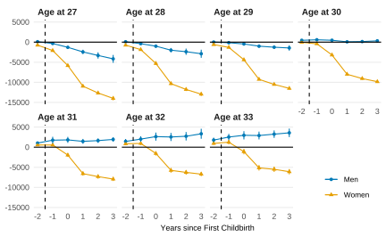
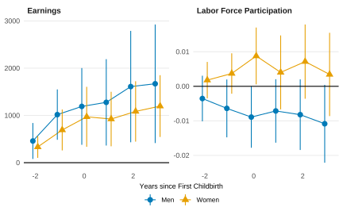

## Abstract

We study the estimation of causal effects on group-level parameters identified from microdata (e.g., child penalties). We demonstrate that standard one-step methods (such as pooled OLS and IV regressions) are generally inconsistent due to an endogenous weighting bias, where the policy affects the implicit weights (e.g., altering fertility rates). In contrast, we advocate for a two-step Minimum Distance (MD) framework that explicitly separates parameter identification from policy evaluation. This approach eliminates the endogenous weighting bias and requires explicitly confronting sample selection when groups are small, thereby improving transparency. We show that the MD estimator performs well when parameters can be estimated for most groups, and propose a robust alternative that uses auxiliary information in settings with limited data. To illustrate the importance of this methodological choice, we evaluate the effect of the 2005 Dutch childcare reform on child penalties and find that the conventional one-step approach yields estimates that are substantially larger than those from the two-step method.

## Important table & figure

::: {layout-ncol="2"}





:::

## BibTeX citation

```bibtex
@online{arkhangelsky2026,
  title = {On Causal Inference with Model-Based Outcomes},
  author = {Arkhangelsky, Dmitry and Yanagimoto, Kazuharu and Zohar, Tom},
  date = {2026-01-09},
  eprint = {2403.19563},
  eprinttype = {arXiv},
  eprintclass = {econ},
  doi = {10.48550/arXiv.2403.19563},
  url = {http://arxiv.org/abs/2403.19563},
  langid = {english},
  pubstate = {prepublished},
  keywords = {Economics - General Economics,Quantitative Finance - Economics}
}
```

