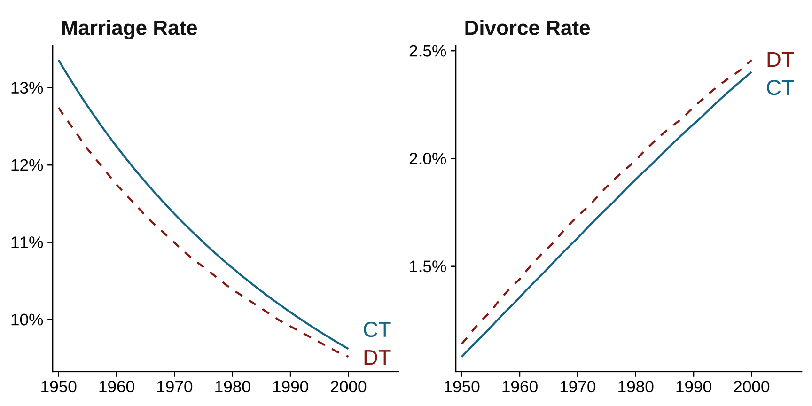
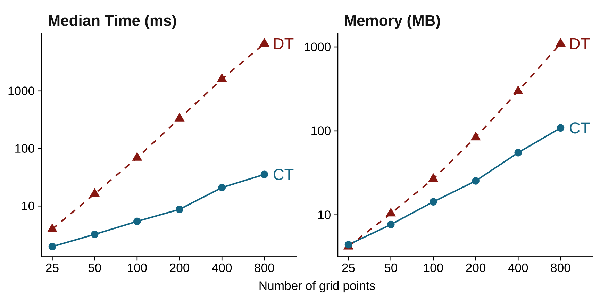

## Abstract



## Important figures





## BibTeX citation

```bibtex
@misc{yanagimoto2026,
  title = {Marriage and Divorce in Continuous Time},
  author = {Yanagimoto, Kazuharu},
  year = {2026},
  eprint = {2602.19798},
  archiveprefix = {arXiv},
  doi = {10.48550/arXiv.2602.19798}
}
```